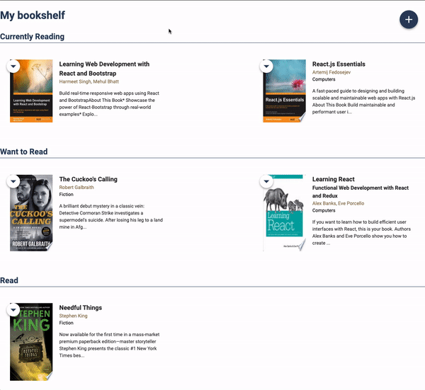

# MyReads Project

This app let you create your own bookshelf.

- You can change the reading status from "Recently reading", "Want to read", "read" or "remove".
- You can search books and add them to your bookshelf.
- The search results are limited to a particular set of search terms, which can be found in [SEARCH_TERMS.md](SEARCH_TERMS.md).

## Installation

1. Clone the GitHub repo:
   `git clone https://github.com/misakimichy/react-my-read.git`

2. `cd react-my-read`

3. `npm install`

4. `npm start`

## Create React App

This project was bootstrapped with [Create React App](https://github.com/facebookincubator/create-react-app).
You can find more information on how to perform common tasks [here](https://github.com/facebookincubator/create-react-app/blob/master/packages/react-scripts/template/README.md).
