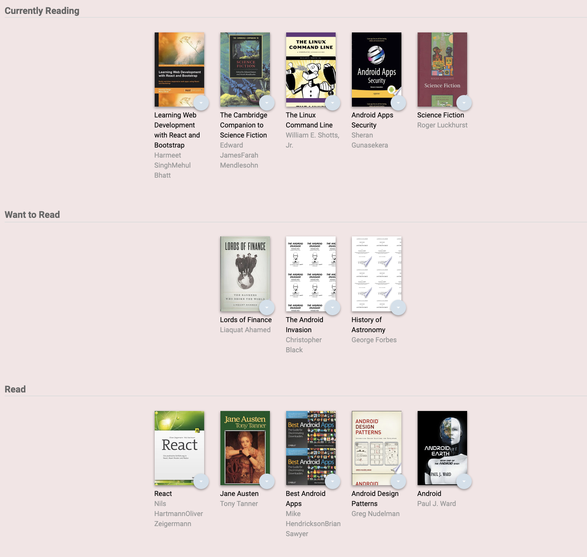

# MyReads Project

This is the React Nanodegree project using the starter template provided by [Udacity](https://github.com/udacity/reactnd-project-myreads-starter).

This app manages the bookshelf and you can change the reading status from "Recently Reading", "Want to Read" and "Read".
You can also search and add books to the shelf. The search results are limited to a particular set of search terms, which can be found in [SEARCH_TERMS.md](SEARCH_TERMS.md).

## Installation

1. Clone the GitHub repo:
   `git clone https://github.com/misakimichy/React-Myread.git`

2. `$cd React-Myread`

3. `$npm install`

4. `$npm start`
   The will start the app in port :3000 on your local machine.

## Create React App

This project was bootstrapped with [Create React App](https://github.com/facebookincubator/create-react-app). You can find more information on how to perform common tasks [here](https://github.com/facebookincubator/create-react-app/blob/master/packages/react-scripts/template/README.md).
